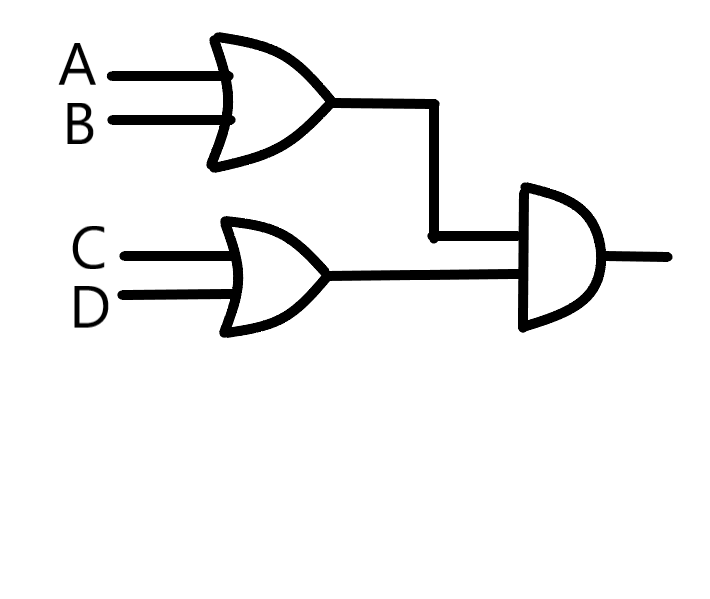
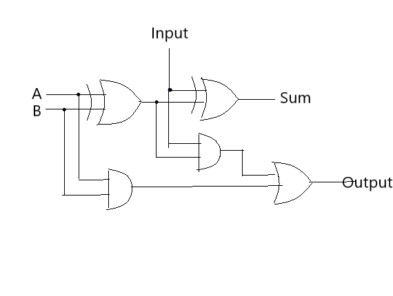

(1) Give the three representations of an AND gate and say in your words what AND means.

**Boolean Expression**

X = A · B

**Logic Diagram Symbol**

**Truth Table**

| A | B | X |
|:--|:--|:--|
| 0 | 0 | 0 |
| 0 | 1 | 0 |
| 1 | 0 | 0 |
| 1 | 1 | 1 |

-------------

(2) Give the three representations of an XOR gate and say in your words what XOR means.

**Boolean Expression**

X = A ⊕ B

**Logic Diagram Symbol**

**Truth Table**

| A | B | X |
|:--|:--|:--|
| 0 | 0 | 0 |
| 0 | 1 | 1 |
| 1 | 0 | 1 |
| 1 | 1 | 0 |

-------------

(3) Draw a circuit diagram corresponding to the following Boolean expression: (A + B)(B + C)

(4) Show the behavior of the following circuit with a truth table:

| A | B | !A | A·B | !A⊕(A·B) |
|:--|:--|:---|:----|:----------|
| 0 | 0 | 1  |  0  |    1      |
| 0 | 1 | 1  |  0  |    1      |
| 1 | 0 | 0  |  0  |    0      |
| 1 | 1 | 0  |  1  |    1      |

--------------------------------

(5) What is circuit equivalence? Use truth table to prove the following formula.

(AB)’ = A’ + B’

| A | B | A·B | (AB)' | A' | B' | A'+B' |
|:--|:--|:----|:------|:---|:---|:------|
| 0 | 0 |  0  | **1** | 1  | 1  | **1** |
| 0 | 1 |  0  | **1** | 1  | 0  | **1** |
| 1 | 0 |  0  | **1** | 0  | 1  | **1** |
| 1 | 1 |  1  | **0** | 0  | 0  | **0** |

-----------------------------------------

(6) There are eight 1bit full adder integrated circuits. Combine them to 8bit adder circuit using the following box diagram.

八个如同所示的电路Input与Output相连即为所求电路

如图是4位的，两个4位的相连也就成8位。

(7) Logical binary operations can be used to modify bit pattern. Such as (X8X7X6X5X4X3X2X1)2 and (00001111)2 = (0000X4X3X2X1)2 We called that (00001111)2 is a mask which only makes low 4 bits to work. Fill the follow expression

(1) (X8X7X6X5X4X3X2X1)2 or (00001111)2 = (x8x7x6x51111)2

(2) (X8X7X6X5X4X3X2X1)2 xor (00001111)2 = (x8x7x6x5x4'x3'x2'x1')2

(3) ((X8X7X6X5X4X3X2X1)2 and (11110000)2 ) or (not (X8X7X6X5X4X3X2X1)2 and (00001111)2) = (x8x7x6x5x4'x3'x2'x1')2

使用维基百科，解释以下概念。

(1)Logic gate

In electronics, a logic gate is an idealized or physical device implementing a Boolean function; that is, it performs a logical operation on one or more binary inputs and produces a single binary output. Depending on the context, the term may refer to an ideal logic gate, one that has for instance zero rise time and unlimited fan-out, or it may refer to a non-ideal physical device[1] (see Ideal and real op-amps for comparison).

(2)Boolean algebra

In mathematics and mathematical logic, Boolean algebra is the branch of algebra in which the values of the variables are the truth values true and false, usually denoted 1 and 0 respectively. 

自学存储电路。维基百科：“Flip-flop”，选择中文：

(1)Flip-flop 中文翻译是？

触发器

(2)How many bits information does a SR latch store?

1 