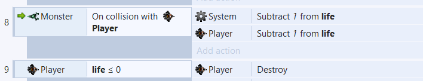

# 第一次游戏制作体验

首先就是下载工具

https://www.scirra.com/construct2

第一次制作游戏难免会遇到麻烦，这时候教程就很重要

https://www.scirra.com/tutorials/37/beginners-guide-to-construct-2/page-1

（英文看不懂？？不用担心谷歌浏览器里有翻译)

照着教程里做，问题应该就不大了。
弄完之后就是这样的了:

然而，要制作一个合格的游戏，就这样是远远不够的。玩过超级玛丽的都知道，游戏一般都会有“命”，“命”用完了之后就会game over。而且，一般来说游戏越进行到最后，难度也就越大，所以我们就能顺势把怪物设计成越到最后，随着分数的增加，速度也就越快。而且，还有一个问题就是，每次game over之后，我们都得把游戏关闭之后在把游戏打开才能继续游戏。要解决这个问题也并不太困难，只要我们设置成game over之后按space键重新开始游戏就好了。好了话不多说，我们现在开始把游戏改进一下。

**1.“命”的设置**

“命”的设置跟分数的设置大同小异，我们可以姑且把它定义成life。也就是再设置一个全局变量（具体可参照教程中score的设置），然后把原来player碰到monster就destroy改为life-1，life<=0,player就destroy。也就是这样：

**2.怪物速度的加快**

这一部分的设置相对来说比较复杂一点，首先我们得再设置一个全局变量MonsterSpeed，初始值我们可以设置为教程中的80，我们不妨设置成每次击中一个敌人，MonsterSpeed就+1，然后再把怪物的速度调成MonsterSpeed，也就是这样：

**3.space键重新开始游戏**

在这之前我们不妨先设置一个game over的界面，很简单，新添加一个text就好了。

game over的界面我们最好设置成在游戏时隐藏，到game over之后再显示出来，就好像这样：

设置完界面我们开始进入正题，space键重新开始游戏。

首先，

其次，

然后设置space键就好了，space键按下之后重置score，life，MonsterSpeed的值，再返回到Layout 1，

好了，完成了🙂，现在就能按下space键重新开始游戏了👌。

现在就能算是一个较为合格的游戏了！😁大功告成！