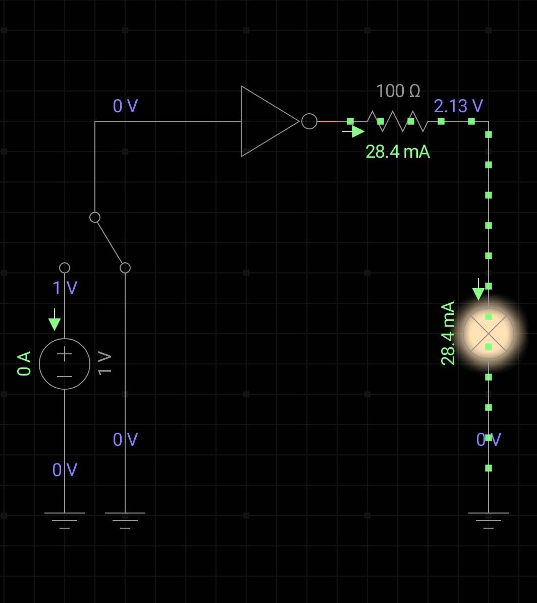
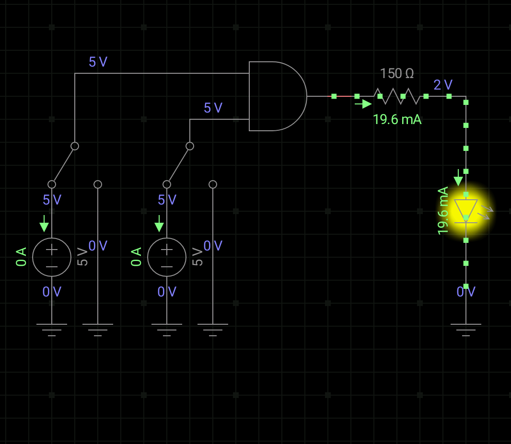

# 硬件编程–电路与二进制运算

https://circuits.io/

鉴于老师给的网站已经登不上去了，所以这个实验就很难做成了。不过我在手机上安装了一个EveryCircuit，用来做电路模拟。

上图为用xor门表示not门。

上图为not门。

上图为and门。

然而结果却不尽如人意，不知道是什么原因，同一个电路，两次制作，结果却不一样。并且，手机上操作也太困难了。555😭

所以我的实验最终还是没做完。。。😑