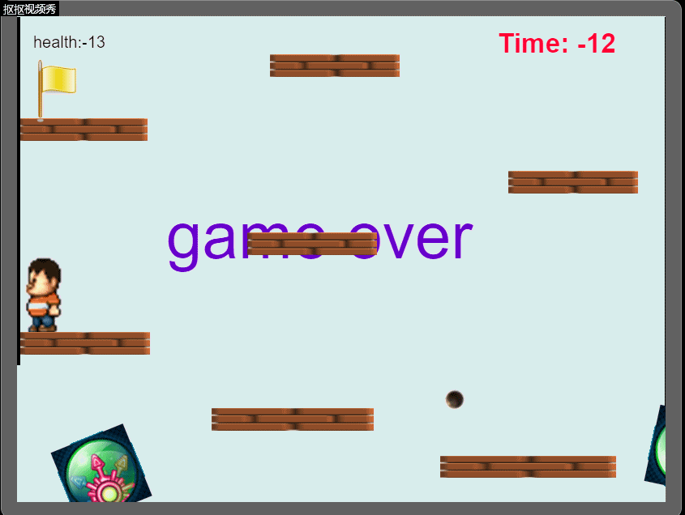

**游戏策划**

一位失落的王子不小心落入坏人的陷阱中，为顺利逃离，王子必须跨越重重障碍到达出口。期间会有两台机关不断向玩家发射炮弹，玩家必须躲过炮弹才能安全通关。

**游戏设计**

```

+---------------------------------------------------------+
| Object：王子                                            |
+---------------------------------------------------------+
| Attribute：图片，帧动画，位置                           |
+-------------------+-------------------------------------+
| Collaborator：精灵 | Event & Actions：钉住 & 动画的切换 |
+-------------------+-------------------------------------+

```

```
+-------------------------------------------+  
| Object: 玩家                              |  
+-------------------------------------------+
| Attributes：图片，位置                    |
+--------------+----------------------------+
| Collaborator | Events & Actions           |
+--------------+----------------------------+
|     精灵     | 跳跃 & 自由落体 & 左右移动 |
+--------------+----------------------------+
```

```
+---------------------------------+  
| Object Name：机关               |  
+---------------------------------+
| Attributes：图片 & 位置         |
+--------------+------------------+
| Collaborator | Events & Actions |
+--------------+------------------+
|   精灵       | 旋转 & 发射炮弹  |
+--------------+------------------+
```

```
+---------------------------------+  
| Object Name：炮弹               |  
+---------------------------------+
| Attributes：图片 & 位置         |
+--------------+------------------+
| Collaborator | Events & Actions |
+--------------+------------------+
|  精灵        | 碰撞 & 销毁自己  |
+--------------+------------------+
```

```
+---------------------------------+  
| Object Name：地板 & 墙壁        |  
+---------------------------------+
| Attributes：图片 & 位置         |
+--------------+------------------+
| Collaborator | Events & Actions |
+--------------+------------------+
|   精灵       |   实心固体       |
+--------------+------------------+
```

**游戏效果**



