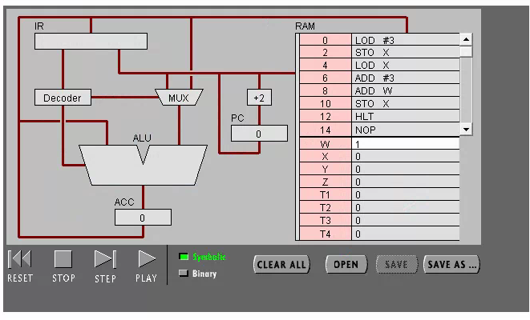
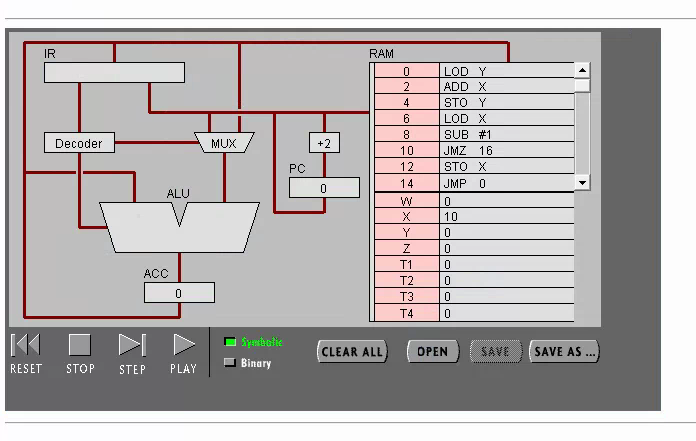
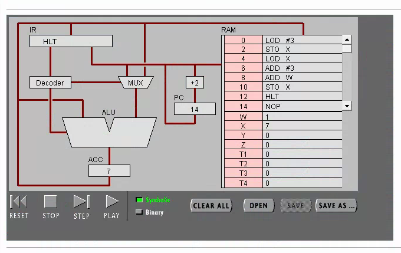

# 硬件编程–机器指令编程

## 学号：18342032

## 姓名：黄星铭

{:.no_toc}

* 目录
{:toc}

### 任务1：简单程序



(2)

1.

PC:读取下一个指令；IR：展示存储指令。

2.

ACC全称Accumulator；作用：存储ALU运算的结果。

3.

PC读取指令→IR存储指令→Decoder→MUX→# 3→ALU运算→储存于ACC→PC指令+2

4.

PC读取指令→IR存储指令→Decoder→MUX→地址W→读取W中的数值→ALU运算→储存于ACC→PC指令+2

5.

LOD #3直接读取3；而LOD W要读取地址W中的数值.

(3)

1.

0001 0100 0000 0111

2.

1000 0000 W

1000 0001 X

1000 0010 Y

1000 0011 Z

1000 0100 T1

1000 0101 T2

1000 0110 T3

1000 0111 T4

3.

8位

4.

int X=3;

X=X+3+W;

### 任务2：简单循环



**程序功能：**

求出Y=$\sum_{i=1}^{10}$i

**c语言计算过程：**

```
while(X){
    Y+=X;
    X--;
}
```

**机器语言计算过程：**

LOD X  0000 0100 1000 0010

ADD X  0000 0000 1000 0001

STO Y  0000 0101 1000 0010

LOD X  0000 0100 1000 0001

SUB #1  0001 0001 0000 0001

JMZ 16  0000 1101 0001 0000

STO X  0000 0101 1000 0001

JMP 0 0000 1100 0000 0000

HLT  0000 1111 0000 0000

**高级语言与机器语言：**

高级语言面向对象是人，故比机器语言更加易读与简洁；机器语言面向对象是机器，机器只能识别0和1，所以只用0和1编写的机器语言一般人是很难读懂的，而且长度也较长。

连接高级语言与机器语言的是汇编语言，汇编语言就是把高级语言的具体逻辑步骤表示出来，所以比高级语言逻辑更加具体。汇编语言翻译成对应得0和1就成了机器语言。

### 实验结果




### 实验小结

实验目标基本达成，得出来的结果也与期望一致。这实验让学生培养自己的动手能力，以便进一步了解cpu的具体运行过程。