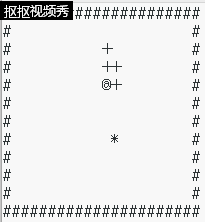

# 贪吃蛇设计与算法

## 设计

基于上次的贪吃蛇代码，我们可以稍微修改，使之成为一条可以自己找寻食物的智能蛇。智能蛇不需要人为的参与，自己就能往食物的方向走。

## 算法

只需要有控制蛇行走方向的函数跟延时函数还有清屏的相关代码即可，首先就要判断食物相对于蛇头的位置，是应该往左走还是往右走，是应该往上走还是往下走，其次就是判断走法是否可行。若可行，则往这个方向走一步，不可行则换一个方向，若四个方向都不可行，那就代表此时已经无路可走，已经Game Over了。（详细代码和运行结果见文章末）

这只是一个简单代码，想要凭这个代码是不可能的，（除非运气特别特别好）。然而要跑完全图，就要用到BFS的算法。总所周知，当蛇头跟着尾巴走的时候，是永远不会死亡的。所以我们就能顺着这个想法，先探索一下能不能安全吃到食物，即吃完食物还能找到一条路通往蛇尾。如果这样的线路不存在，则需先跟着蛇尾走，直到能安全吃食物为止。这样就能最大限度地接近于跑完全图了。


[详细可参照一下dalao的博客](https://blog.csdn.net/sysu_liangwj/article/details/78917078)

## 创新玩法

可以设置两条蛇，一条是电脑控制地智能蛇，一条是人为控制的人工蛇，这样就能上演精彩的人机大战了。

### 详细代码：
```
#include<stdio.h>
#include<stdlib.h>
#include<time.h>
#include<unistd.h>

#define SNAKE_MAX_LENGTH 200 
#define SNAKE_HEAD '@'
#define SNAKE_BODY '+'
#define BLANK_CELL ' '
#define SNAKE_FOOD '*'
#define WALL_CELL '#'

//snake stepping: dy=-1(up),1(down);dx=-1(left),1(right);0(no mopve);
void snakeMove(int dy,int dx);
//put a food randomized on a blank cell;
void put_food(void);
// out cells of the grid;
void output(void);
//outs when gameover;
void gameover(void);

char direct(void);

char map[12][23]=
    {"######################",               //直接打出初始状态的表格 
     "#++++@               #",
     "#                    #",
     "#                    #",
     "#                    #",
     "#                    #",
     "#                    #",
     "#                    #",
     "#                    #",
     "#                    #",
     "#                    #",
     "######################"};
int flag1=1,flag2=1
;

// define vars for snake,notice name of vars in C
int snakeX[SNAKE_MAX_LENGTH]={1,2,3,4,5};       //蛇身和蛇头坐标 
int snakeY[SNAKE_MAX_LENGTH]={1,1,1,1,1};
int snakeLength = 5,foodx,foody;

int main(){
    char ch;
    int dy,dx;
    put_food();          //生成食物 
    int i=13;while(i--)
            printf("\033[1A \033[K \033[u");    
    output();        //生成初始图 
    printf("\033[?25l");    
    while(1){
        sleep(1);              //延时函数  每一秒执行一次 
        dy=0;
        dx=0;
        ch=direct();
        if(ch=='a'||ch=='s'||ch=='d'||ch=='w'){
            switch(ch){              //对输入进去的ch转变为相应的横纵坐标变化 
                case 'w':
                    dy=-1;
                    break;
                case 's':
                    dy=1;
                    break;
                case 'a':
                    dx=-1;
                    break;
                case 'd':
                    dx=1;
                    break;
            }
            snakeMove(dy,dx);             //对蛇的位置做出处理 
            put_food();                   //生成食物 
            //printf("\033[2J"); 
            int i=13;while(i--)
            printf("\033[1A \033[K \033[u"); 
            output();                     //输出当前的图表 
            printf("\033[?25l");            
            gameover();                   //判断是否为Game Over 
            if(!flag1){                   //flag1为游戏是否进行的标准  若为零则表示已经Game Over 
                return 0;
            }
        }
    }
    return 0;
}

void snakeMove(int dy,int dx){
    int i,j;
    if(map[snakeY[snakeLength-1]+dy][snakeX[snakeLength-1]+dx]==SNAKE_FOOD){ 
        snakeLength++;                                                           //如果蛇头碰到食物   则长度+1 
        flag2=1;                                                                 //flag2为是否生成食物的标准 
        snakeX[snakeLength-1]=snakeX[snakeLength-2]+dx;                          //由于长度加长  故只需要改变蛇头位置即可 
        snakeY[snakeLength-1]=snakeY[snakeLength-2]+dy;
        map[snakeY[snakeLength-2]][snakeX[snakeLength-2]]=SNAKE_BODY;
        map[snakeY[snakeLength-1]][snakeX[snakeLength-1]]=SNAKE_HEAD;
    }
    else{
        map[snakeY[0]][snakeX[0]]=BLANK_CELL;                                   //把蛇尾位置换为空格 
        for(i=0;i<snakeLength-1;i++){
            snakeX[i]=snakeX[i+1];                                              //把整条蛇的坐标往后推一位 
            snakeY[i]=snakeY[i+1];
            map[snakeY[i]][snakeX[i]]=SNAKE_BODY;
        }
        snakeX[snakeLength-1]=snakeX[snakeLength-2]+dx;                         //蛇头位置做出相应变化 
        snakeY[snakeLength-1]=snakeY[snakeLength-2]+dy;
        map[snakeY[snakeLength-1]][snakeX[snakeLength-1]]=SNAKE_HEAD;    
    }
    
}

void put_food(void){
    if(flag2){
        srand((unsigned)time(NULL));                                          //若flag2为true  则需要生成一个食物 
        foody=rand()%10+1;
        srand((unsigned)time(NULL));
        foodx=rand()%19+1;                                  //保证食物的坐标处在方框内 
        while(map[foody][foodx]!=BLANK_CELL){
            srand((unsigned)time(NULL));                   //若当前位置不为空  则重新生成随机数直至位置为空 
            foody=rand()%10+1;
            srand((unsigned)time(NULL));
            foodx=rand()%19+1;
        }
        map[foody][foodx]=SNAKE_FOOD;                           //在当前位置放食物 
        flag2=0;                                        //flag2为0  暂时不用放食物了 
    }
}

void output(void){
    int i;
    for(i=0;i<12;i++){
        printf("%s\n",map[i]);                      //把表的每行打印出来 
    }
}

void gameover(void){
    int i;
    for(i=0;i<snakeLength-1;i++){
        if((snakeX[i]==snakeX[snakeLength-1]&&snakeY[i]==snakeY[snakeLength-1])||snakeX[snakeLength-1]==0||snakeX[snakeLength-1]==21||snakeY[snakeLength-1]==0||snakeY[snakeLength-1]==11){
            printf("Game Over!!\n");                      //判断蛇头是否碰撞到自身或者碰到墙壁   是则Game Over 
            flag1=0;                                      //flag1为0表示不用继续游戏了 
            break;
        }
    }
}

char direct(void){
    int ans,dx,dy;
    dx=foodx>snakeX[snakeLength-1]? 1:-1;                //判断向着食物走是向左还是向右 
    dy=foody>snakeY[snakeLength-1]? 1:-1;                //判断向着食物走是向上还是向下 
    if(map[snakeY[snakeLength-1]][snakeX[snakeLength-1]+dx]==BLANK_CELL||map[snakeY[snakeLength-1]][snakeX[snakeLength-1]+dx]==SNAKE_FOOD){
        if(dx==1){
            return 'd';                          //判断相应的走法是否可行                     
        }
        else{
            return 'a';
        }
    }
    if(map[snakeY[snakeLength-1]+dy][snakeX[snakeLength-1]]==BLANK_CELL||map[snakeY[snakeLength-1]+dy][snakeX[snakeLength-1]]==SNAKE_FOOD){
        if(dy==1){
            return 's';
        }
        else{
            return 'w';
        }
    }
    if(map[snakeY[snakeLength-1]][snakeX[snakeLength-1]-dx]==BLANK_CELL||map[snakeY[snakeLength-1]][snakeX[snakeLength-1]-dx]==SNAKE_FOOD){
        if(dx==1){
            return 'a';
        }
        else{
            return 'd';
        }
    }
    if(dy==1){
        return 'w';
    }
    else{
        return 's';
    }
}
```

### 运行结果：



